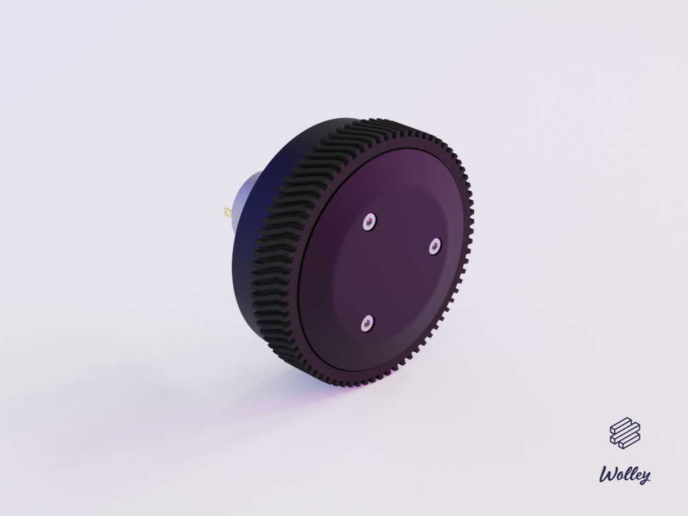

The Mechanical Project for the Wolley Wheel Module
==================================================

A robot wheel with built-in 2-stage planetary gearbox, motor and controller.

| Specification |      |
| ------------- | ----:|
| Stage 1 ratio | 9.33 |
| Stage 2 ratio |  5.5 |
| Total ratio   | 51.3 |

Parts
-----

### 3D Printable

| Qty | Part        | Material                      | Part Number |
| ---:| ----------- | ----------------------------- | -----------:|
|   1 | Enclosure   | ABS, PET-G or PLA*            |      100116 |
|   1 | Back        | PET-G                         |      100117 |
|   1 | Middle      | PAHT-CF15 or PLA*             |      100119 |
|   1 | Carrier     | PET-G                         |      100122 |
|   3 | PlanetGearA | PET-G or PLA*                 |      100103 |
|   3 | PlanetGearB | PET-G or PLA*                 |      100107 |
|   1 | RingGearA   | PET-G or PLA*                 |      100102 |
|   1 | Wheel       | PET-G                         |      100106 |
|   1 | SunGearA    | PET-G                         |      100118 |
|   1 | SunGearB    | PET-G or PLA*                 |      100108 |
|   1 | Front       | PAHT-CF15, PET-G, ABS or PLA* |      100120 |

_* HTPLA, Tough PLA, PLA+ or PLA with carbon fiber_

### Other Parts

| Qty | Part                                                         |
| ---:| ------------------------------------------------------------ |
|   4 | Socket Screw ISO 4762, M3 x 15 mm                            |
|   6 | Socket Screw ISO 4762, M3 x 4 mm                             |
|   2 | Socket Screw ISO 4762, M2.5 x 6 mm                           |
|   1 | Hex Stand-off, M3 x 11 mm (Ettinger 05.03.111)               |
|   3 | Round Stand-off, M3 x 4 mm, Ø4.76 mm (Harwin R30-5000402)    |
|   4 | Threaded Insert, M3 (Ruthex RX-M3x5.7)                       |
|   3 | Neodym Magnet, 2 x 4 mm (ex. Meder NdFeB N35)                |
|   1 | DC Motor (ex. Mabuchi RS-385PV-2465)                         |
|   1 | Wolley MotorECU (100135)                                     |

How to Build
------------

1. Print all parts without cogs with 0.25 mm layer height or thinner.
2. Print all other parts with 0.20 mm layer height or thinner.
3. Sandpaper all parts slightly and make sure they were printed as intended.
   This might not be needed at all for the parts printed in PET-G.
4. Assemble the motor, _MotorECU_ and _Back_.
5. Glue _SunGearA_ on the motor shaft using Loctite 648 and the mount tool.
6. Assemble the rest according to the explosion drawing. 
7. Make sure it is functional by rotating the wheel by hand. If it does not
   work, more sandpaping or better printing may be neccessary.
8. Run the motor for a bit to make the gearbox smoother. This could also be
   done by hand.
9. Take it apart and lubricate the internal parts slightly with lithium grease.
10. Assemble it again and use Loctite thread lock for the M3x4mm screws for
    preventing them from loosening.

Release Notes
-------------

Version 1.2:
 - Replaced the MotorECU v1.3 with v1.4 (no changes).
 - Added more verified materials to the READMED file.

Version 1.1:
 - Improved _Enclosure_ that is circular, covers more and has threaded
   inserts for easier assembly.
 - Made adjustments to fit a Mabuchi RS-385PV motor.
 - Sturdier _Middle_.
 - Improved the _Tire_ with pattern with better grip.
 - Better fitting _Carrier_.
