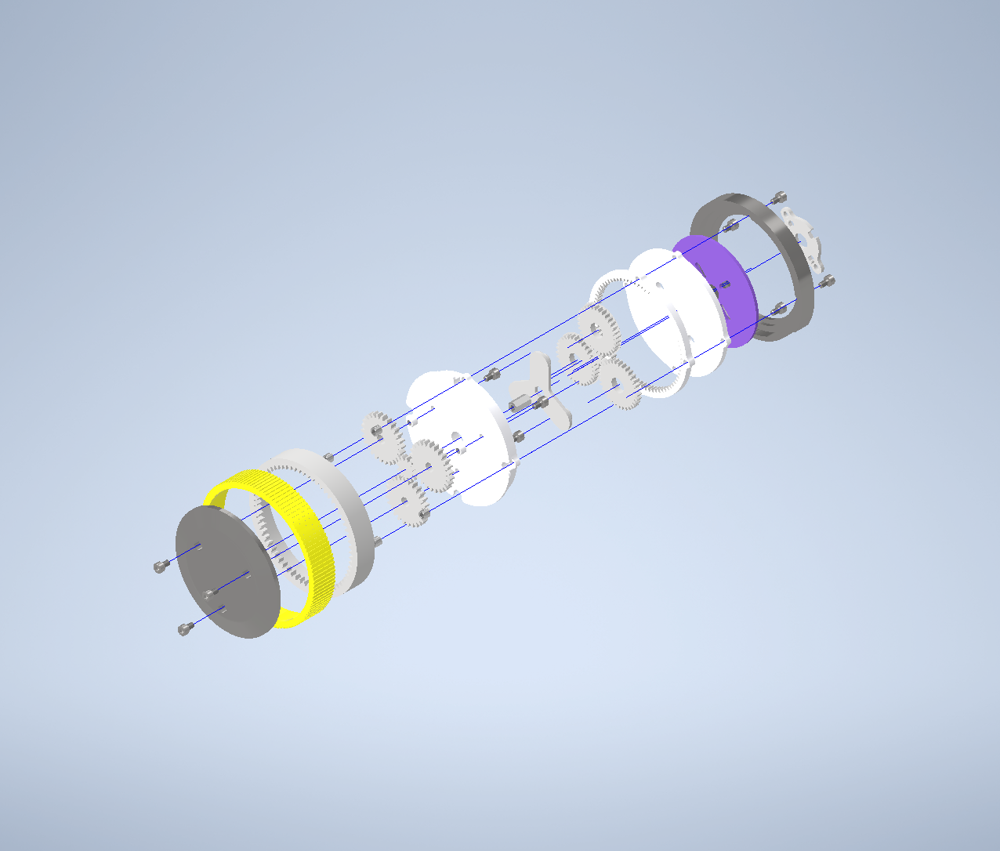

The Mechanical Project for the Wolley Speed Reducer Wheel Module
================================================================

A robot wheel with built in 2-step planetary gearbox and controller.

Parts
-----

### 3D Printable

| Qty | Part        |
| --- | ----------- |
|   1 | Enclosure   |
|   1 | MotorPlate  |
|   1 | Back        |
|   1 | Middle      |
|   1 | Carrier     |
|   3 | PlanetGearA |
|   3 | PlanetGearB |
|   1 | RingGearA   |
|   1 | Wheel       |
|   1 | SunGearA    |
|   1 | SunGearB    |

### Other Parts

| Qty | Part                                        |
| --- | ------------------------------------------- |
|   4 | M3x9mm                                      |
|   8 | M3x4mm                                      |
|   2 | M3x6mm                                      |
|   2 | M3 Hex-standoff 30mm (Ettinger 05.03.301)   |
|   1 | M3 Hex-standoff 11mm (Ettinger 05.03.111)   |
|   7 | M3 Circular Spacer 4mm (Harwin R30-5000402) |
|   3 | Neodym magnet, 2x4mm (Meder NdFeB N35)      |
|   1 | DC motor                                    |
|   1 | ECU (PCB)                                   |

How to Build
------------

1. Print all parts without cogs in PLA with 0.25 mm layer height and parts
   with cogs with atleast 0.14 mm layer height.
2. Sandpaper all parts slightly and make sure they were printed as intended.
3. Assemble it according to explosion drawing. 
4. Make sure it is functional by rotating the wheel by hand. If it does not
   work, more sandpaping or better printing may be neccessary.
5. Run the motor for a bit to make the gearbox smoother. This could also be
   done by hand.
6. Take it apart and lubricate the internal parts with lithium grease.
7. Assemble it again and use Loctite for preventing the screws from loosening.
